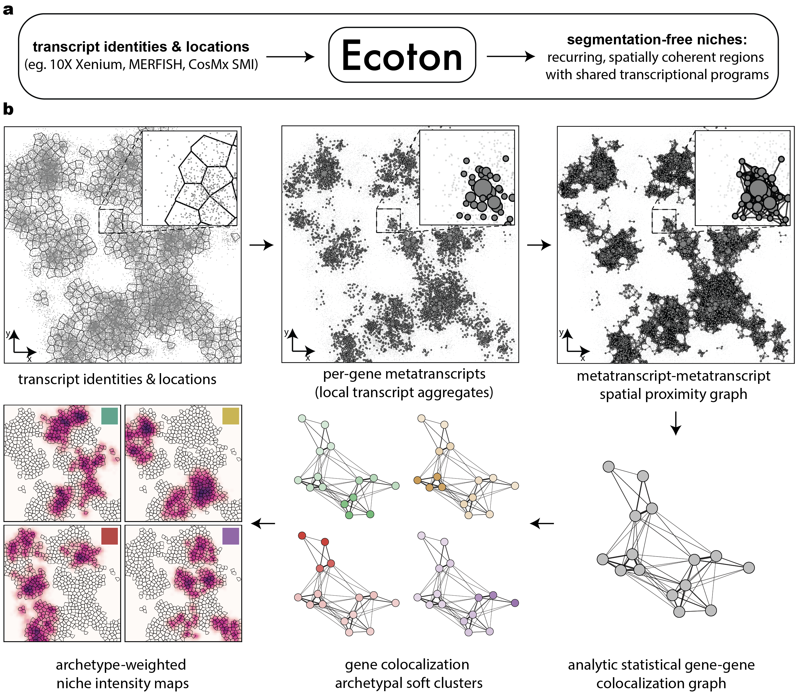

<p align="center">
  
</p>

<h1 align="center">Ecoton</h1>

<p align="center">
  Expression colocalization of transcripts for niche discovery.
</p>

<p align="center">
  
  
  
</p>



Ecoton takes as input the spatial coordinates and gene identities of individual transcripts and outputs a gene-gene colocalization graph along with spatial niches defined directly from transcript colocalization patterns.

The workflow is as follows:

1) Proximal transcripts from the same gene are clustered into metatranscripts.
2) A metatranscript–metatranscript spatial proximity graph is constructed based on local distances.
3) Gene pairs that colocalize more frequently than expected under a permutation-based null model are identified, yielding a gene–gene colocalization graph.
4) Archetypal decomposition of this graph produces soft gene modules.
5) Each archetype is mapped back to binned transcript expression in space using a linear combination of spatially normalized gene maps, giving archetype-specific niche intensity maps.
6) These continuous niche intensity maps are thresholdable at progressive levels to derive binary niches.
7) For downstream analyses, these transcript-level niches can optionally be intersected with cell segmentation to derive cell-level niche labels.

To install, run `pip install .` in this repository after cloning it.

## Quick Start Tutorial

Refer to `scripts/ecoton_quick_start_tutorial_lymph.ipynb` for a tutorial on using Ecoton for a public Xenium 5K human lymph node dataset. 

## CLI workflow

Ecoton can also be run directly from a command-line workflow. The following combines all steps of Ecoton before downstream analyses.

### Run as installed command

```bash
ecoton \
	--transcripts-path ../spatial_5k/data/transcripts.parquet \
	--transcripts-format parquet \
	--output-dir processed_data
```

(can also run as module instead, using `python -m ecoton`)

### Parameters

- `--mode` (default: `xenium_5k`)
- `--k` (default: `25`)
- `--seed` (default: `1`)
- `--organism` (default: `Human`)
- `--min-points` (default: `3`)
- `--bin-size` (default: `8.0`)
- `--smoothing-radius` (default: `8.0`)
- `--weight-threshold` (default: `0.3`)
- `--save-module-plot` to save selected module visualization

### Outputs

The workflow writes these files into `--output-dir`:

- `workflow.pkl`
- `runtime_tracking.pkl`
- `selected_archetypal_modules.png` (when `--save-module-plot` is set)
